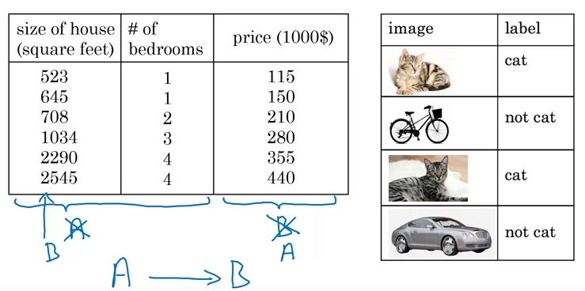
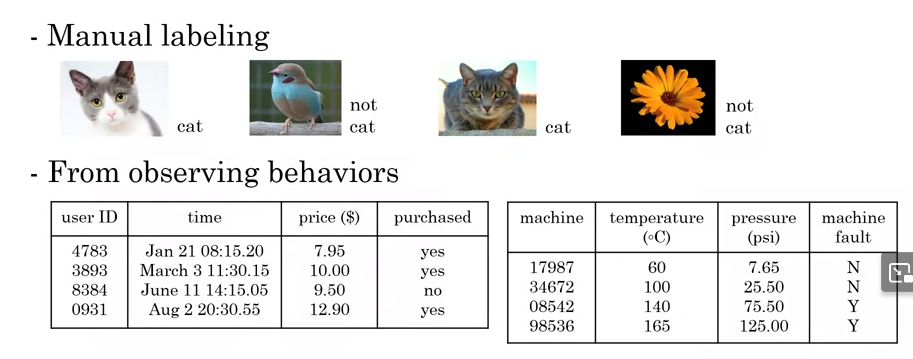
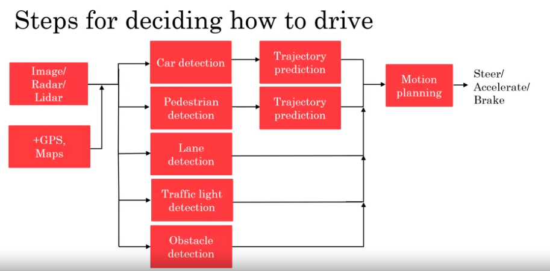
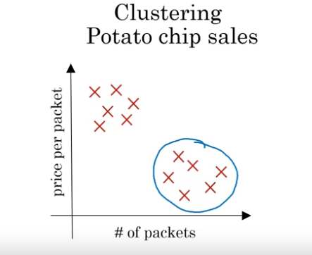

# AI for Everyone
## Week 1
ANI - Artificial narrow intelligence
AGI - Artificial general intelligence
Supervised learning - Input, Output - Requires a lot of data

Data can be acquired:
- manual labeling
- from observing behavior
- download from website/partnership

Data can be messy:
- usually the more data the better BUT
- Garbage In, Garbage out
- Incorrect labels, missing values
- multiple types of data. 
- Call ai team before and during data collecting

### Machine learning vs Data Science vs Deep Learning vs AI:
#### AI > Machine Learning > Deep Learning

- **AI** is broad field that encompasses machine learning, deep learning, NLP, computer vision, robotics.
Performs tasks that requires human intelligence, such as perception, reasoning, learning, decision-making, and language understanding.
- **Data Science** - is extracting knowledge or insight of data. Summarizes conclusions. ie. newly renovated house give 15% more revenue, and houses with same.
- **Machine learning** - gives computers the ability to learn without being explicit programmed. Often using statistical methods, linear regression, decision trees, and clustering. ie. will find ads for customers they may click,
- **Deep Learning** - Focused on Neural network - more complex that traditional machine learning 

The main difference between DL and ML is the complexity of the models that they use to learn from data.

### Difference between Internet company and Shopping mall + website
- A/B testing
- Short iteration time
- Decision pushed down to engineers
### Difference between AI company and Any company + DL
- Strategic data acquisition
- Unified data warehouse, so teams can connect dots
- They have specific people in this role
### Transform company to AI company
- Execute pilot projects
- Build an in-house AI team
- Provide broad AI training
- Develop an AI strategy
- Develop internal and external communications

### What ML can do
Rule of thumb if you need less of a second to come up with a conclusion to an issue,
is this spam, whats the price, whats on picture... ML can do it.
- Can do: Self driving cars, where are other cars
- Cant do: Human gestures for a car - police man, hitchhiker, bike turns signal... Cant deduce intention
- Can do: Based on 10k images diagnose pneumonia
- Cant do: Based on medical textbook 10 images, cant figure out while medical doctor can

ML will have problem if there is:
- difference in quality of data, ie different xray machines, one produces noise. (perform on new data)
- learning new concepts on small amount of data

Neural networks consists of neurons, small processing units that are good for one task.
But then those neurons are stacked in layes and each layer process different parts of data.
Layer 1 process pixel difference, layer 2 10x10 pixel areas of a face, layer 3 100x100 areas of face.

## Week 2
Data is transforming many different job functions,.

### Examples
- **Example of speech recognition** 
1. Collect data - a lot of people say hello
2. Train model, to map A->B to mapping. audio#1 -> "Hello"
3. Deploy model to a small or large group of people. So other people have other accents and you get that data back

- **Example of self-driving car**
1. Collect data - images of cars and draw rectangles on top of cars
2. Train model - iterate many times until good enough
3. Deploy model - Get data back. Maintain/update model for golf carts for example

- **Example of shop commerce: Get insights like better to market more/less during holidays.**
1. Collect data - userId, country, time, webpage
2. Analyze data - iterate to get insight
3. Suggest hypotheses / actions. Deploy and analyze

- **Coffee mugs**
1. Mix clay - supplier, mixing time
2. Shape mug
3. Add glaze
4. Fire kiln - humidity, temperature, duration
5. Final inspection

- **Example - line inspection**
1. Check if dents or defects in a product.

- **Example - recruiting**
1. Email outreach - Based on cv
2. Phone screen - Not enough people are passing phone screen
3. Onsite interview
4. Offer

- **Example - A/B testing**
1. Which is generating better traffic

- Crop analysis
1. When to plant
2. Weed killing

### Working with AI team
1. When finding project for ML, find area that AI can handle and bussines oriented
2. Specify acceptance criteria. Detect mug defects with 95% accuracy. Provide test set like 1k images
2. Provide Training set and Test set
3. Pitfall: Dont expect 100% accuracy. Limitations of ML, insufficient data, mislabeled data, ambigues labels

#### Technical tools for AI teams
Machine learning frameworks:
1. TensorFlow
2. PyTorch
3. Keras
4. MXNet
5. CNTK
6. Caffe
7. PaddlePaddle
8. Scikit-learn
9. R 
10. Weka

Research publications:
1. Arxiv

Open-source repo
1. Search face recognitions github

GPU - Graphics Processing Unit - good for graphics and deep learning system
CPU - Central Processing Unit - Computer process
Cloud vs On-premises - Buy or Build
Edge deployment - for cars, where processing needs to happen where data is collected. No time to send to server

---
## Week 3
### Smart speaker - "Hey device, tell me a joke"
1. Trigger word/wakeword detection. (Audio) -> Hey device (0/1)
2. Speech recognition (Audio) -> "tell me a joke". Audio to text transcript
3. Intent recognition - Joke, Time, Play music, Call, Weather, Unit conversion
4. Execute specialized program "joke()"

### Car/Pedestrian detection
1. Image, Radar, Lidar
2. Car/Pedestrian detection
3. Motion planning
4. Steer/Accelerate/Brake

Each one of these steps, are handled by separate role

### Roles in a AI team
1. Software Engineer - joke execution, ensure self-driving reliability
2. ML Engineer - A to B mapping 
3. A) Applied ML Scientist - apply new research in work
3. B) ML Learning Researcher - Extend state-of-art in ML
4. Data Scienties - Examine data and provide insight. Make presentation to team/executive
5. Data Engineer - Organize data, save/read data in cost effective way
6. AI Product Manager - what is feasible and valuable

Small team would be Software Engineer or ML Engineer/Data Scientist or yourself.

### AI Transformation Playbook
1. Execute pilot projects to gain momentum
- Show traction 6-12 months
- Can be inhouse or outsourced
2. Build an in-house AI team
- CEO -> Bussines Units. AI team should support other BU. CTO can be the chief of AI team, or have its own CAIO
3. Provide broad AI training
- Provide broad AI training, to see how AI can affect their role
- Curate, dont create content. Creating content is expensive
4. Develop an AI strategy. (People often start with this one without knowing AI enough)
- Its hard to compete on horizontal scale with Google...
   but on vertical scale on specific case, for example recognize images of weed or cabbages.
- Design strategy is called "Virtuos cycle of AI". Create AI for specialize for your industry.
- Strategy data acquisition
- Unified data warehouse. Shipping and packaging, connect points in data.
- Low cost/High value
5. Develop internal and external communications
- Investor relations
- Government relations
- Consumer/user education
- Talent recruitment
- Internal communication

### AI pitfals
- Cant solve everything
- Dont get 2 ML to do your problems. Combine them with BU
- AI steps fails, need iteration
- Metrics - timeline estimations, milestones
- Keep building the team, no need for AI superstar
- Get started, second project is better than first

### First steps
- Get friends to learn about AI. This course, reading group
- Start brainstorming projects. No project to small
- Hire ML people to help
- Hire AI lead
- Discuss with CEO/Board possibilities. Will your company be more valuable or effective with help of AI

### Examples - Supervised learning
A-B mapping is most valuable one
#### Computer vision
- Image classification. Cat pics, face recognition. Works on whole image
- Object detection - Parts of image
- Image segmentation - Precise segments of image
- Tracking

#### NLP - Natural language processing
- Text classification - Email -> Spam/Not spam. Product description -> Product category
- Sentiment recognition - Rating based on text
- Information retrieval - web search, based on text
- Name entity recognition - Find names of people in text or locations. Phone numbers, countries...
- Machine translation
- Parsing, part of speech tagging - separates which words nouns, verbs... Parsing combines noun with determiner and combines words

#### Speech
- Speech recognition, speech-to-text
- Trigger word, wakeword detection
- Identify by voice, speaker ID
- Speech synthesis, text-to-speech, TTS

#### Robotics
- Perception - figuring out what's around
- Motion planning - finding a path for robot to follow
- Control - sending commands to motors

#### General machine learning
- Unstructured data - images, audio, text. Usually more general so people more familiar with it
- Structured - table of data. Usually specific to company

## Examples - Unsupervised learning. Reinforcement learning
Doesnt tell AI system what it wants, instead gives data and AI will find something meaningfull
- Clustering - Price per packet, number of packets. Based on if customer is student in student area. Cat videos on youtube

- Transfer learning - if you have car detection with 100k images, you can train on golfcarts for 1k images
- Reinforcement learning - program does whatever it wants and reward it based on performance. Let program do what it wants. Uses reward signal. For video games, chess...
- GANs (Generative Adversarial Network) - Synthesize new images from scratch
- Knowledge Graph - key information about people. Like hotel has wifi, address, phone... Or person name, year...

---
## Week 4
### Impact on society 