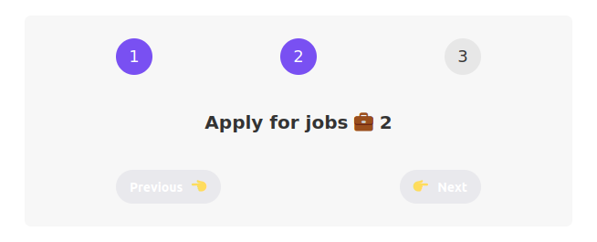

# Counter
```
npx create-react-app@5 jio-counter
cd jio-counter
npm start
```

### Updating state
Method 1 will increase state by one
```
const handleNext = () => {
  setStep(state + 1)
  setStep(state + 1)
  setStep(state + 1)
}
```
Method 2 will increase state by 3
```
const handleNext = () => {
  setStep((val)=>val + 1)
  setStep((val)=>val + 1)
  setStep((val)=>val + 1)
}
```