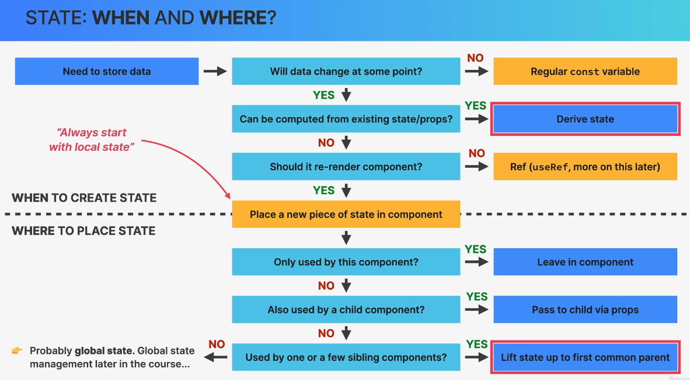
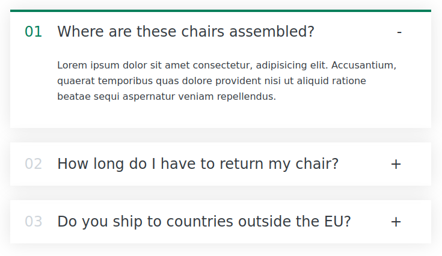

# State
Can be local and global (Context-api, Redux)


## Derived state
```
function Stats ({items}) {
  // Derived state
  const length = items.length;
  return (
    <p className="stats">
      <em>Start adding some items to your packing list 🚀. {length ? `Total items ${length}` : ''} {length && `Total items ${length}`}</em>
    </p>
  );
}
```

# Accordion


## Props children
```
<AccordionItem
    curOpen={curOpen}
    onOpen={setCurOpen}
    title="Test 1"
    num={22}
    key="test 1"
  >
    <p>Allows React developers to:</p>
    <ul>
      <li>Break up UI into components</li>
      <li>Make components reusuable</li>
      <li>Place state efficiently</li>
    </ul>
  </AccordionItem>
</div>

function AccordionItem({ num, title, curOpen, onOpen, children }) {
  const isOpen = num === curOpen;

  function handleToggle() {
    onOpen(isOpen ? null : num);
  }

  return (
    <div className={`item ${isOpen ? "open" : ""}`} onClick={handleToggle}>
      <p className="number">{num < 9 ? `0${num + 1}` : num + 1}</p>
      <p className="title">{title}</p>
      <p className="icon">{isOpen ? "-" : "+"}</p>

      {isOpen && <div className="content-box">{children}</div>}
    </div>
  );
}
```